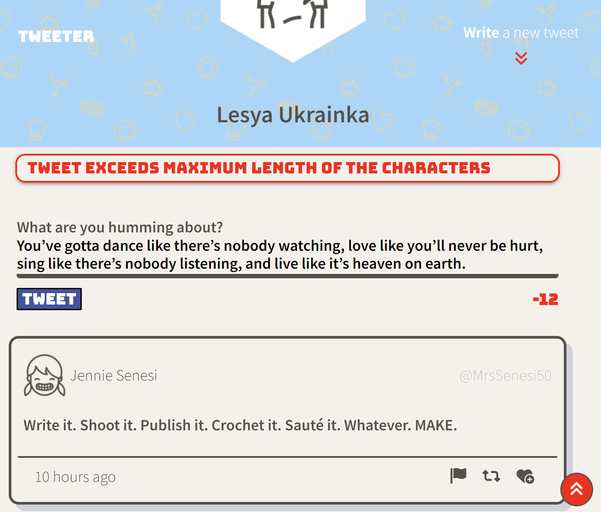
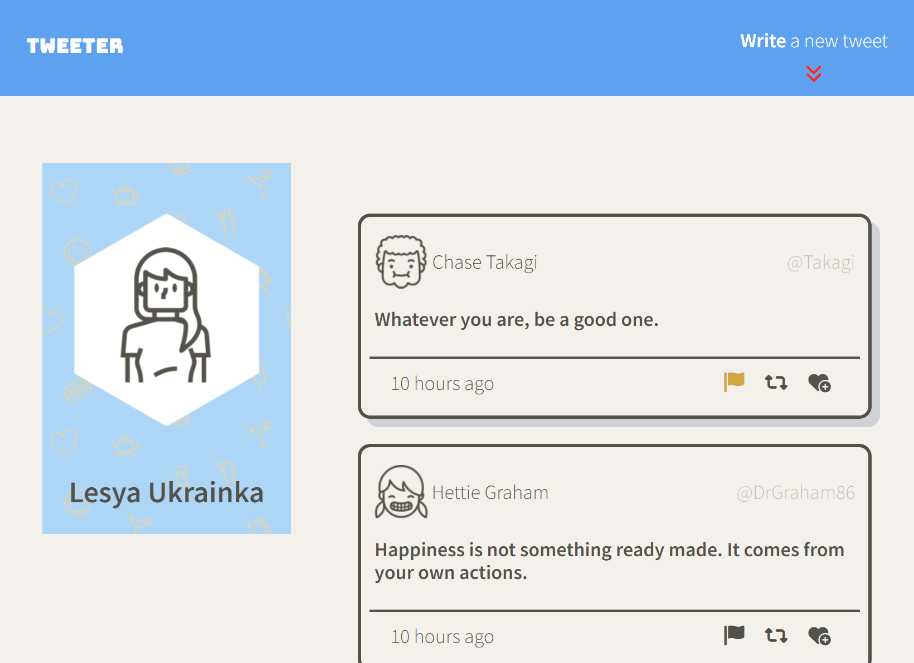

# Full Stack Project: Tweeter

Tweeter is a simple, single-page Twitter clone.

This project was made to practice in HTML, CSS, JS, jQuery and AJAX front-end skills, as well as Node, Express back-end skills.

It has a responsive design, that will change depending on the  device's width. Was designed using "mobile first" approach.

Made as a full stack web development educational project for [Lighthouse Labs](https://www.lighthouselabs.ca/).

## Getting Started

1. Git Clone this repo (using the `git clone git@github.com:iKayden/tweeter.git` command).
2.  Install all dependencies (using the `npm install` command).
3. Start the web server using the `npm run local` command. The app will be served at <http://localhost:8080/>.
4. Go to <http://localhost:8080/> in your browser.

## Final Product Showcase

- It has minimalistic and adorable design. The page doesn't reload on submission and displays tweets immediately. This is mobile version design. There is an active character counter that changes color if the number of characters exceeds the limit of 140.

- This is a much wider screen (1024px) design. The transition is smooth and provides good use of space with a lot of place for scaling. 

- The tweet text area has a validation logic with popups that can be closed by clicking on them.  When you scroll down the button at the bottom right will appear that will take you smoothly all the way to top.

- At the top right we have the "Write a new tweet" button that toggles your tweet area to and from hiding and puts the focus right in for typing, so no time is wasted. Variety of hover effects are present, such as shadows and interactive color changes.

## Dependencies

- `Express`
- `Node 5.10.x` or above

### Made by ["Kyrylo (Kayden) Kharchenko"](https://github.com/iKayden)

